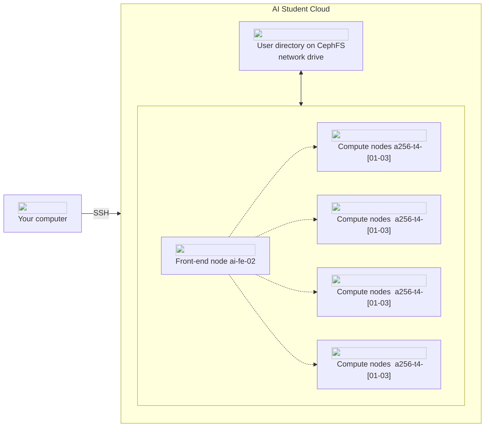

AI Student Cloud consists of a front-end node (ai-fe02.srv.aau.dk) and a number of compute nodes. AI Student Cloud is a heterogeneous platform with several different
types of hardware available in the compute nodes.

The compute nodes of the AI Student Cloud currently include: ==PUT IN NEW AI STUDENT CLOUD NODES==

| Node name  | CPU                       | System RAM | GPU                         |
| ---------- | ------------------------- | ---------- |  -------------------------- |
| a256-t4-01 | 2x AMD EPYC 7302 16-core  | 256GB      | 6x NVIDIA T4 GPUs, 16GB RAM |
| .......... | ........................  | .......... | ........................... |
| .......... | ........................  | .......... | ........................... |
| .......... | ........................  | .......... | ........................... |
| .......... | ........................  | .......... | ........................... |
| .......... | ........................  | .......... | ........................... |
| .......... | ........................  | .......... | ........................... |
| .......... | ........................  | .......... | ........................... |

This diverse selection of
different hardware in the AI Student Cloud allows for more suitable choice of
specific hardware according to your task. For example, the DGX-2
compute nodes are better suited for the
comutationally intensive training of deep neural networks, while the
compute nodes with T4 GPUs are better suited for inference tasks using
an already trained model.

 ==UPDATE TO MATCH AI STUDENT CLOUD SYSTEM==

### Front-end node
The front-end node is used for logging into the platform, accessing your files, and starting jobs on the compute nodes. The front-end node
is a relatively small server which is *not* meant for performing heavy
computations; only light-weight operations such as transferring files
to and from AI Student Cloud and defining and launching job scripts.

### File storage
The AI Student Cloud stores your
files in your user directory. Your user directory is stored on a
network file system that allows all of the nodes within the platform
can access your files. This means that if you store or edit a file in
your user directory on the front-end node, the compute nodes
can see the same file and contents thereof. The nodes
access the network file system in a shared manner, so there is nothing
you need to do to synchronise the files between the nodes.

The details of defining and running jobs are described in the
[Getting Started](/getting-started/getting-access) section.
