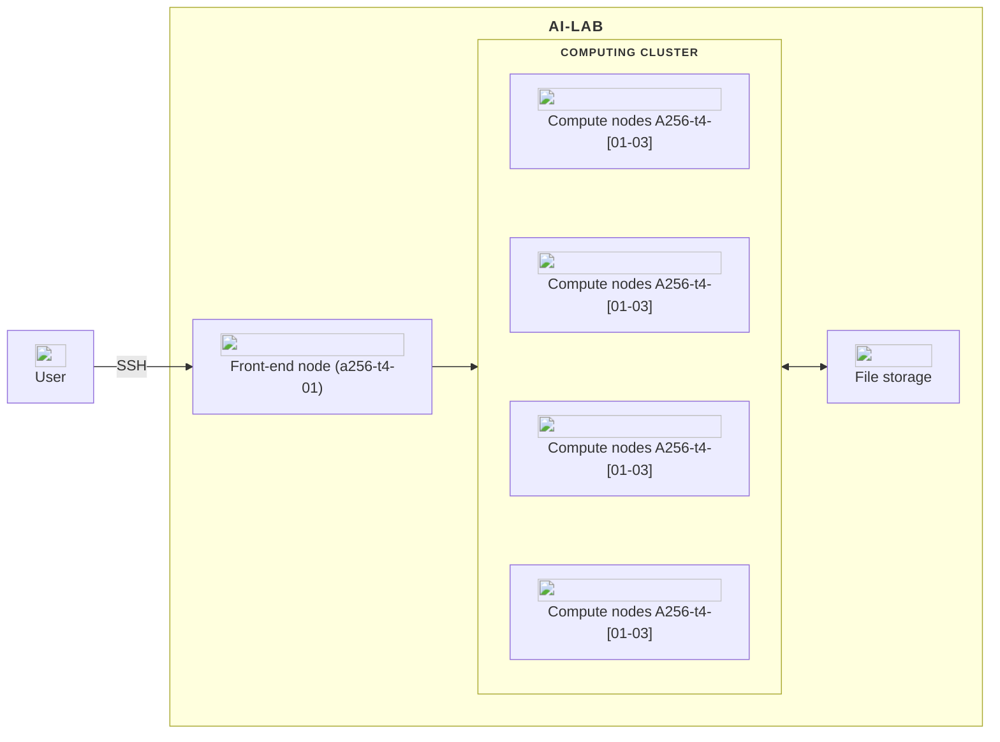

# System overview

The AI-LAB platform is built around several key components, including a front-end node for managing tasks and code, a robust queue system for scheduling jobs, file storage that is accessible from all nodes, and versatile compute nodes equipped with diverse hardware options.

In this overview, you will find a description of each major component of AI-LAB. Below, is a diagram illustrating the architecture of the AI-LAB platform.



 ==UPDATE TO MATCH AI-LAB SYSTEM==


!!! custom "<span class="custom-callout-icon">:fontawesome-solid-computer: Front-end node</span>"
    You start by logging into a front-end node. This is the gateway to the HPC system. Here, you can manage files, write and edit code, and prepare your computational tasks. The front-end node is *not* for heavy computations but for preparation and interaction with the HPC system.

<span class="arrow-down">:octicons-arrow-down-24:</span>

!!! custom "<span class="custom-callout-icon">:octicons-database-16: File storage</span>"
    AI-LAB stores your files in your user directory. Your user directory is stored on a network file system that allows all of the nodes within the platform
    can access your files. This means that if you store or edit a file in your user directory on the front-end node, the compute nodes can see the same file and contents thereof.

    <div class="tree">
      <ul>
        <li><i class="fa fa-folder-open"></i> Ceph/
          <ul>
            <li><i class="fa fa-folder-open"></i> home
              <ul>
                <li><i class="fa fa-folder-open"></i> doman
                  <ul>
                    <li><i class="fa fa-folder"></i> user <span>your user directory </span>
                    </li>
                  </ul>
                </li>
              </ul>
            </li>
            <li><i class="fa fa-folder-open"></i> project <span>shared project directories</span>
              <ul>
                <li><i class="fa fa-folder"></i> projectgroup_X
                </li>
              </ul>
            </li>
            <li><i class="fa fa-folder-open"></i> course <span>directory with course specific material</span>
              <ul>
                  <li><i class="fa fa-folder-open"></i> Course 1. Introduction to TensorFLow
                    <ul>
                      <li><i class="fa fa-folder"></i> Images</li>
                      <li><i class="fa fa-file"></i> tensorflow.sif</li>
                    </ul>
                  </li>
                  <li><i class="fa fa-folder-open"></i> Course 2. ...
                </li>
              </ul>
            </li>
            <li><i class="fa fa-folder-open"></i> container <span>directory with ready-to-use container images</span>
              <ul>
                <li><i class="fa fa-file"></i> tensorflow.sif</li>
                <li><i class="fa fa-file"></i> pytorch.sif</li>
                <li><i class="fa fa-file"></i> ...sif</li>
              </ul>
            </li>
          </ul>
        </li>
      </ul>
    </div>

<span class="arrow-down">:octicons-arrow-down-24:</span>

!!! custom "<span class="custom-callout-icon">:material-human-queue: Queue system</span>"
    After preparing your computational task, you submit it to AI-LABs queue system, [Slurm](/glossery/#slurm). Slurm is like a traffic controller. It receives job submissions from users and decides when and where to run each job based on available resources and the job's requirements. Your job is placed in a queue until resources are available.

<span class="arrow-down">:octicons-arrow-down-24:</span>

!!! custom "<span class="custom-callout-icon">:fontawesome-solid-box-open: Containers</span>"
    One job could be to deploy an applications such as TensorFlow. All applications on AI-LAB must be run in [containers](/glossery/#containers). Containers are like virtual packages that hold all the stuff your program needs to run smoothly. They bundle up everything – the code, libraries, and settings.

    #### List of pre-download containers
    In the `container` directory, located on AI-LAB, you can find pre-downloaded containers ready to use (the list will be updating from time to time). If you would like to propose a new container to be stored in the container directory, please write to us through the [AAU service portal](https://www.serviceportal.aau.dk/) and refer to CLAAUDIA in the subject.

    ```console
    PyTorch (CPU/GPU)
    TensorFlow (CPU/GPU)
    ImageMagick (CPU)
    MATLAB (CPU/GPU)
    ```

<span class="arrow-down">:octicons-arrow-down-24:</span>

!!! custom "<span class="custom-callout-icon">:octicons-server-24: Compute nodes</span>"
    Once resources are available, Slurm dispatch the submitted job to specific [compute nodes](/glossery/#compute-nodes) within the AI-LAB [computing cluster](/glossery/#computing-cluster).

    #### Overview of compute nodes
    AI-LAB is a heterogeneous platform with several different types of hardware available in the compute nodes and currently include:

    | Node name      | CPU                           | System RAM | GPU                             |
    | -------------- | ----------------------------- | ---------- |  ------------------------------ |
    | ==a256-t4-01== | ==2x AMD EPYC 7302 16-core==  | ==256GB==  | ==6x NVIDIA T4 GPUs, 16GB RAM== |
    | .............. | ............................  | .......... | ............................... |

    This diverse selection of different hardware in AI-LAB allows for more suitable choice of
    specific hardware according to your task. ==MAYBE EXPLAIN EXAMPLES OF WHAT JOBS DIFFERENT NODES WOULD BE FIT FOR==


